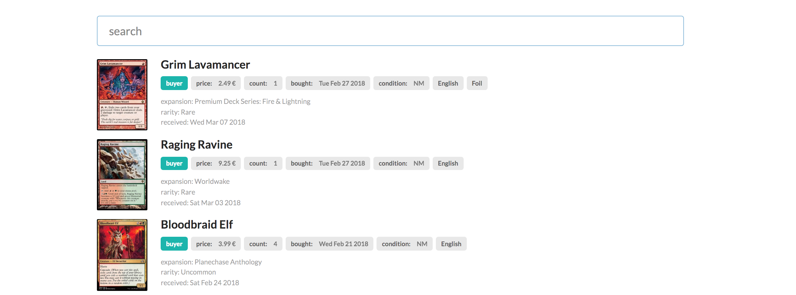

# mtgEquity
List all your bought and received [Magic](https://magic.wizards.com) trading cards from [cardmarket.com](https://www.cardmarket.com/en/Magic). It uses a [API](https://www.mkmapi.eu/ws/documentation) to get the necessary data of your user to display all received cards.

## Clone
```
git clone https://github.com/sabralod/mtgEquity.git
```

## Setup
You have to copy the ```creds.json``` file to the mtgEquity directory.
```
cd ./mtgEquity
npm install --save
```

## Run
```
gatsby develop
```

## Problems
If you run the project more time, it occurs that you have to delete the cache directory.
Simply run before you start again:
```bash
rm -rf .cache/
```

## Used Libariers

- [Gatsby](https://www.gatsbyjs.org/docs/)
- [React](https://reactjs.org/docs/hello-world.html)
- [Semantic-UI React](https://react.semantic-ui.com/introduction)

## Screenshot

